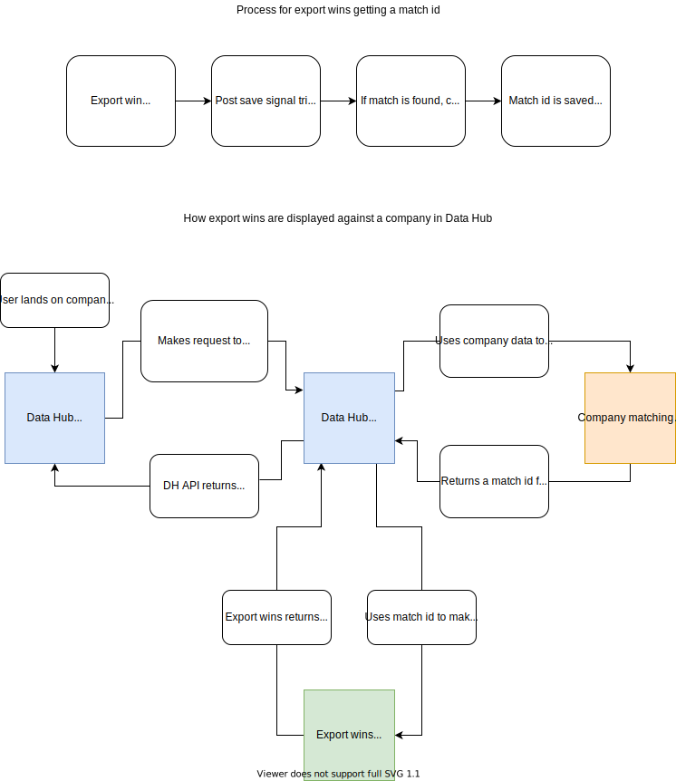

# Export wins and Data Hub integration

## Background

[Export wins](https://github.com/uktrade/export-wins-ui) is a service where users can log an export which they have helped a business successfully carry out - this is an 'export win'.

Export Wins does not use Data Hub companies to store wins against, so in order for Data Hub to show export wins against a company record, there needs to be an alternative way to link the company who has exported to a company in Data Hub.

To do this, we use the [Company Matching Service](https://github.com/uktrade/company-matching-service).

## How the integration works

