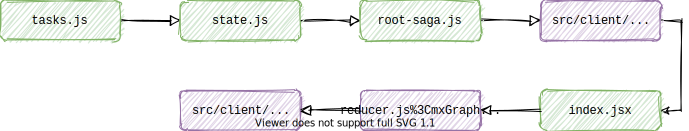

# Redux and Saga

In Data Hub we use [Redux](https://redux.js.org/) for state management and [Saga](https://redux-saga.js.org/) for handling side effects (e.g. fetching data from the API).

Wrapping our saga tasks we have a custom [`Task`](https://github.com/uktrade/data-hub-frontend/blob/master/src/client/components/Task/index.jsx#L47-L101) component and some other custom implementations with Redux. This can mean that just reading the Redux and Saga docs might not be enough to smoothly get started with writing new Data Hub code. So this high level guide goes over the flow of how to add a new Saga task and its accompanying Redux actions/reducers. From personal experience, it can get quite messy navigating all the different files you need to touch in order to simply load some data from the API and render it to a React component.

## Flow

The flow to add a new feature looks something like this. The green files are mainly concerned with Saga and the purple files are mainly concerned with Redux.

<br />



<br />

### 1. task.js

This is where you will put your task. The task function takes exactly one parameter - the payload - and returns a promise.

```ts
type Task = (payload: any) => Promise<any>
```

In the example below it returns the promise created by `axios.get()`. This example is making the axios call through the api-proxy (so be sure to add your api url to the api-proxy allowlist).

```
export function getPipelineList() {
    return axios
        .get('/api-proxy/v4/pipeline-item', { params: ... })
        .then(handleSuccess, handleError)}
```

### 2. state.js

This is where we will store our task name in a constant and also export our state ID. You don't need to store the task name is a constant, but it might help you prevent a typo later on.

```
export const TASK_GET_PIPELINE_LIST = "TASK_GET_PIPELINE_LIST"

export const ID = "pipelineList"
```

### 3. root-saga.js

This is where you register your task with saga.

```
import { TASK_GET_PIPELINE_LIST } from './components/Pipeline/state'
import * as pipelineListTasks from './components/Pipeline/tasks'

export default function rootSaga() {
    yield fork(
        tasksSaga({
            [TASK_GET_PIPELINE_LIST]: pipelineTasks.getPipelineList,
            ...
```

### 4. src/client/actions.js

We also need to namespace our Redux action that will trigger once our Saga task has successfully completed. We do this so we don't give any two different actions the same name and accidentally trigger both actions.

It should follow the pattern of [COMPONENT_NAME]__[ACTION_VERB].

```
export const PIPELINE__LIST_LOADED = "PIPELINE__LIST_LOADED"
```

### 5. index.jsx

Now it's time to hook up your task to your React component. You can do this in two ways with our `Task` wrapper - either with `Task.Status` or `getTask`. `Task.Status` gives you a built in loading box and is best used for loading data from the API before the component renders. `getTask` is more versitile, you can add a loading box if you want, but you don't have to. It is best used for tasks like submitting a post request when clicking a form button.

You can find more in-depth documentation on how the `Task` component works in `src/client/components/Task/index.jsx`, e.g. how the `Task.Status` takes `renderStatus` and `renderError` which you can use to override its default progress and error views.

```
import { TASK_GET_PIPELINE_LIST, ID } from '../state'
import { PIPELINE__LIST_LOADED } from '../../../../../../client/actions'

<Task.Status
    name={TASK_GET_PIPELINE_LIST}
    id={ID}
    progressMessage="loading projects"
    startOnRender={{
            payload={...} // if you want to pass a payload to the tasks you do it here
            onSuccessDispatch: PIPELINE__LIST_LOADED
        }}
>

    {() => ...}
```

```
<Task>
    {(getTask) => {
        const getPipelineTask = getTask(TASK_GET_PIPELINE_LIST, ID)

        ...

        getPipelineTask.start({
            payload: {...}
            onSuccessDispatch: PIPELINE__LIST_LOADED
        })
    }}
```

### 6. reducer.js

The reducer module is where we update our state based on what action was dispatched. Remember, all Redux functions must be pure, so we're making a copy of the exisitng state and updating that - not updating the state directly.

```
// put your initial state here if needed
const initialState = {
    lists: {},
}

export default (state = initialState, { type, result }) => {
    switch(type) {
        case PIPELINE__LIST_LOADED:
            return {
                ...state,
                lists: {
                    ...state.lists,
                    ...result,
                },
            }
        default:
            return state
    }
}
```

### 7. src/client/index.jsx

This is the last step. We just need to compose our reducer into the root reducer.

```
import { ID as PIPELINE_LIST_ID } from './components/Pipeline/state'
import pipelineListReducer from './components/Pipeline/reducer'

const store = createStore(
    combineReducers({
        ...
        [PIPELINE_LIST_ID]: pipelineListReducer,
        ...
    })
)
```
