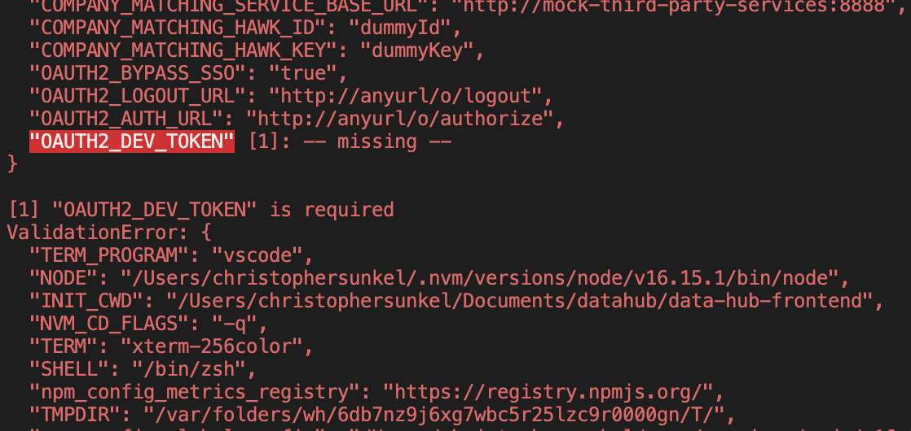
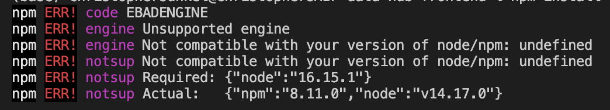
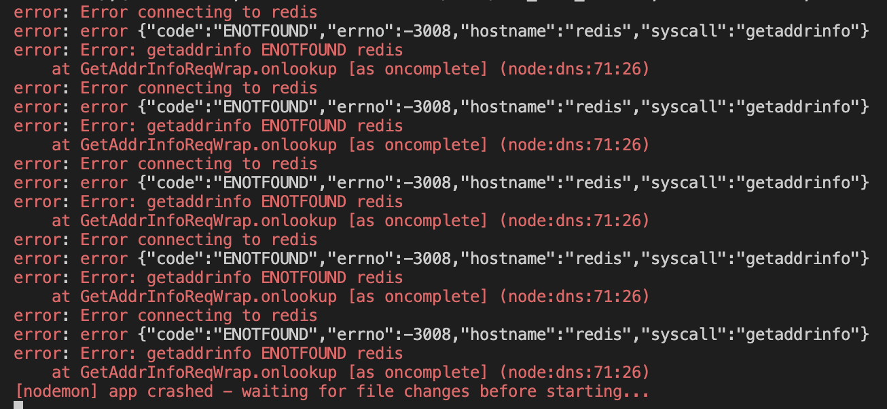
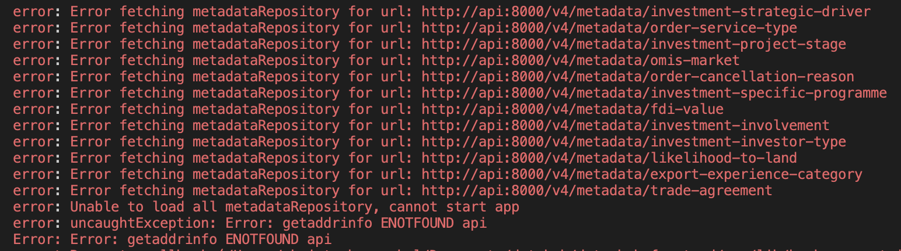
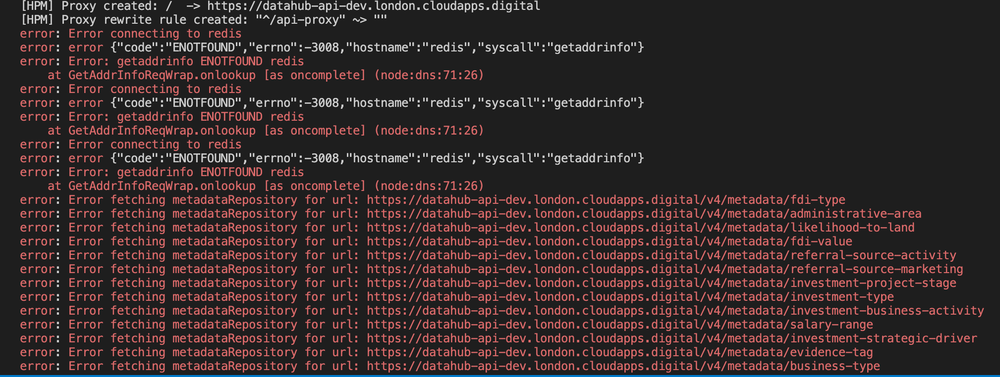
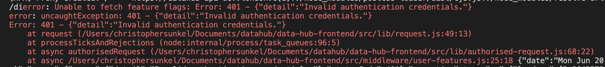
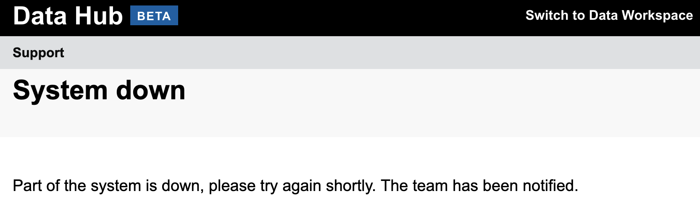
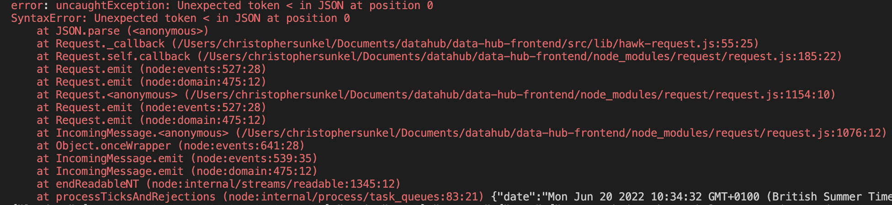

# Local troubleshooting

This document was created to provide solutions to common issues that occur when running the frontend locally. The issues are categorised by the method used to bring up the application.

When updating this document please use the following template:

```
### Issue title
[brief description of issue]

Screenshot:


**Solution** If there is a single permanent fix for this issue enter it here.

**Short-term fix** If there is a temporary workaround or some of 'sticky-tape' solution enter it here.

**Long-term fix** If there is a permanent fix for the issue (or if one is being worked on) enter it here.
```

## Docker issues

This section should include issues that occur when running the frontend in Docker.

## Native issues

This section should be used for native issues that occur regardless of what API you are using.

### Missing environment variable

This error appears if one or more of the required environment variables is missing or has no value set. The error message will tell you which variables need to be changed.



**Solution** Assign a value to the missing variable.

### Unsupported engine error

This error occurs when your local Node version is incorrect.



**Short-term fix** Run the command `nvm use [required version]` (you may need to run `nvm install [version]` first).

**Long-term fix** Set your default NVM alias to the required version.

### Running natively against a local API instance

#### Error connecting to Redis

This error usually appears if there is a mismatch between your local API and frontend env files, or if one of your env files has incorrect/outdated environment variables set.



**Solution** Ensure that any shared environment variables are correct and are set to the same value in both projects.

#### Error fetching metadataRepository

This error occurs when the frontend can't connect to your local API instance.



**Solution** Ensure that your `API_ROOT` variable has been set correctly. The local API will use `http://localhost:8000`.

### Running natively against a live environment (dev/staging)

#### Error connecting to Redis

When running against a live environment, this error usually occurs if you run `npm run develop` without a local Redis instance running, or if you have incorrect environment variables.



**Solution** Close your frontend instance, then start a new native redis instance (follow the [redis setup instructions](https://github.com/uktrade/data-hub-frontend/blob/master/docs/Installing%20redis%20natively.md) if you have not done this before).

Once this is running, you should update the following environment variables:

- `REDIS_HOST` should be set to `localhost`
- `REDIS_URL` should be set to `redis://localhost:6379`
- `DATA_HUB_BACKEND_ACCESS_KEY_ID` and `DATA_HUB_BACKEND_SECRET_ACCESS_KEY` should be set to the values from Vault (if working with the investment homepage, you will need to do the same for all variables with the prefix `HELP_CENTRE` or the page will not load).

Once this is done, the app should start after running `npm run develop`.

#### Invalid authentication details

This error occurs when your `OAUTH2_DEV_TOKEN` is out of date or hasn't been set correctly.



**Solution** Bring down your frontend and remove the current value for `OAUTH2_DEV_TOKEN`. Generate a new access token by navigating to the relevant `/add-access-token/` page (for convenience you can set this to last for up to 168 hours), then set the value of `OAUTH2_DEV_TOKEN` to the newly-generated token. The frontend should now work after running `npm run develop`.

#### 'System down' page appears

This error occurs when your local redis server is brought down whilst the app is still running.



**Solution** Bring down your local frontend, restart your redis instance and run `npm run develop`. The frontend should then work as expected.

#### Unexpected token < in JSON at position 0

This error is caused when you try to connect to a live environment without turning the VPN on.



**Solution** Bring down your local frontend, enable the VPN and then run `npm run develop` again. The frontend should now work correctly.
