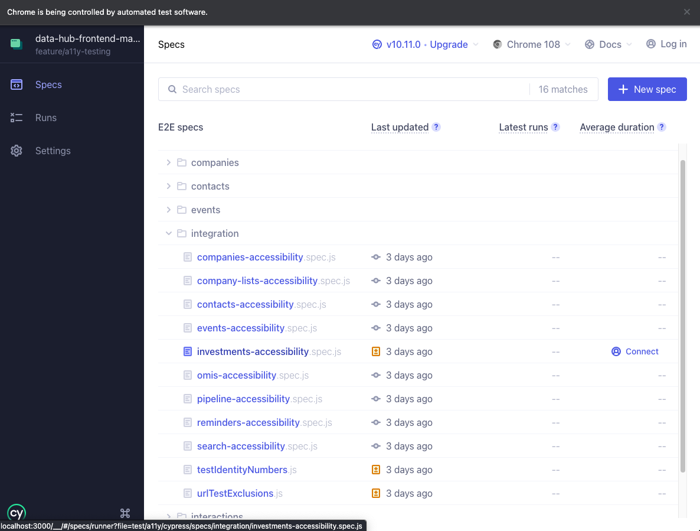

# Cypress A11y Accessibility Testing

> “ a11y ” stands for “accessibility.” It is a numeronym, with 11 representing the count of letters between the letter a and the letter y.

## Running the Tests in the Browser

To run the tests first ensure any locally running instances of the application are stopped. Then start 4 terminal sessions to for the following instructions.

1. *in the route of the appication run* redis-server
2. *navigate through the folder **test** then **sandbox** and run* npm install && npx nodemon .
3. *in the route of the appication run* npm run develop
4. *in the route of the appication run* npm run test:a11y:watch

This will open Cypress in the browser. At the time of writing when the browser opens select **E2E Testing** and then start E2E testing in the browser of your choice.

## Configuration

All the files needed for the A11y accessibility tests can be found in test/a11y/cypress/specs/integration.
There is a single js file per mount point of the application and the testing has been configured to automatically test any urls found in src/lib/urls.js relating to that mount point.

Identification numbers such as companyId and countryId are accessed from testIdentityNumbers.js.

Any urls entered in urlTestExclusions.js are excluded from testing.

Data and Export endpoints are excluded as a default.

## Add a New Mount Point

To create a set of tests for a new mount point

1. copy an existing spec.js file within the integration folder. Rename this file to match your mount point name.
2. Open the new file and change
    - const mountPoint = urls.your-mount-point
    - const mountPointName = 'your-mount-point-name'

The new test will automatically appear in the browser when running the tests and include any urls connected to the mount point.